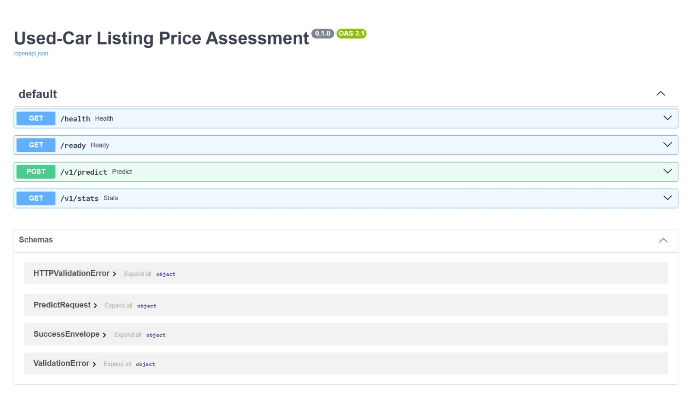
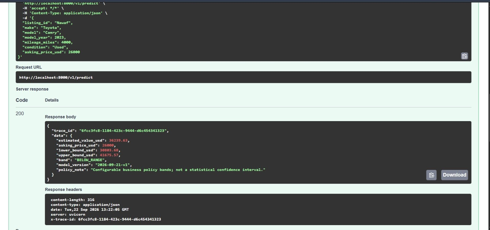
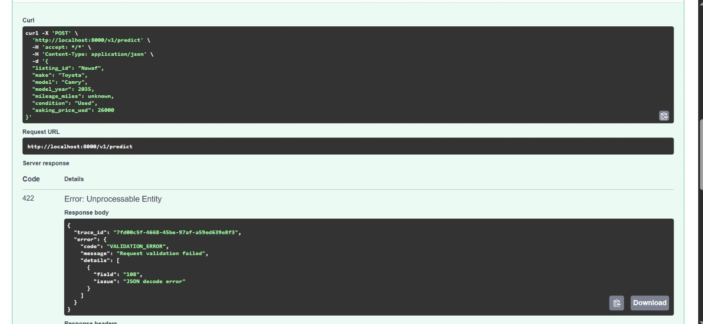
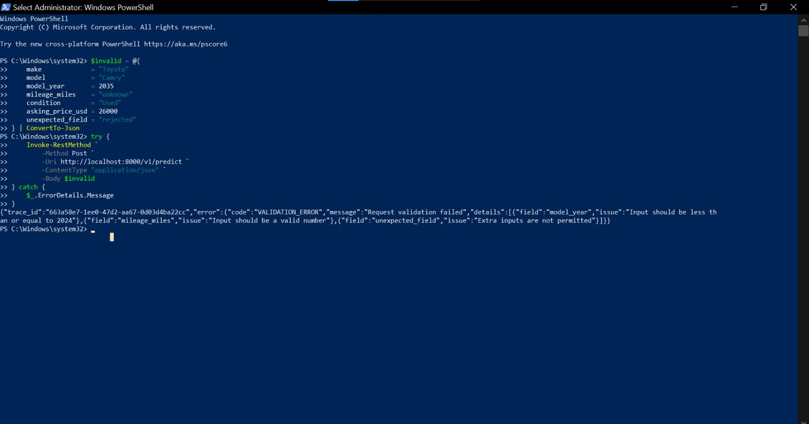
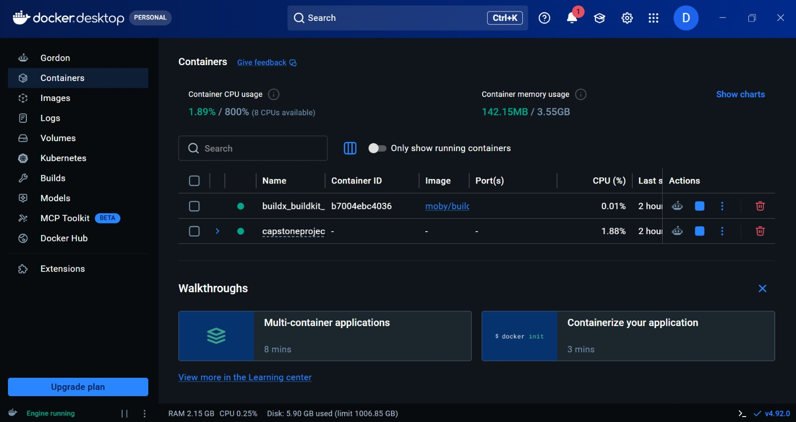
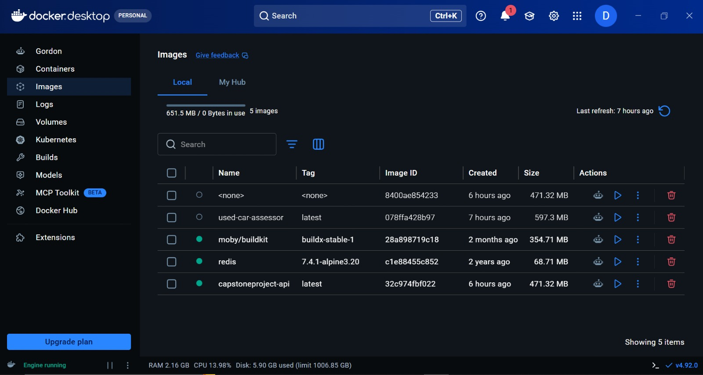

# Five-Minute Demo Guide

## 0:00-1:00 - Start and verify

```bash
docker compose up --build --detach --wait
curl --fail http://localhost:8000/health
curl --fail http://localhost:8000/ready
```

Explain that liveness means the process can answer, while readiness requires the checksum-validated/warmed model and healthy Redis dependency.

## 1:00-2:00 - Valid request

```bash
curl --request POST http://localhost:8000/v1/predict \
  --header "Content-Type: application/json" \
  --header "X-Trace-ID: demo-valid-001" \
  --data '{"listing_id":"demo-a","make":"Toyota","model":"Camry","model_year":2020,"mileage_miles":40000,"condition":"Used","asking_price_usd":26000}'
```

Point out the independent estimate, inclusive lower/upper policy bounds, `WITHIN_RANGE`, model version, and matching trace ID. State that asking price is absent from model features.

## 2:00-2:45 - Malformed request

```bash
curl --request POST http://localhost:8000/v1/predict \
  --header "Content-Type: application/json" \
  --data '{"make":"Toyota","model":"Camry","model_year":2035,"mileage_miles":"unknown","condition":"Used","asking_price_usd":26000,"extra":"rejected"}'
```

Show HTTP 422, field-level validation issues, unknown-field rejection, and the same safe trace-aware error envelope.

## 2:45-3:30 - Useful extension

```bash
curl --fail http://localhost:8000/v1/stats
```

Show the Redis-persisted total and policy-band counters. Explain why Redis is a genuine supporting service and part of readiness.

## 3:30-4:15 - Behavioural model test

```bash
python -m pytest -m behavioral -q
```

Explain the three real-model checks: changing `listing_id` has no effect, increasing asking price cannot move toward a cheaper policy band, and a versioned golden case checks numeric output within a documented tolerance. Mention that the golden file must never be regenerated merely to make CI pass.

## 4:15-5:00 - CI and publishing

Open `.github/workflows/ci.yml` and show the dependency chain: lint/type/architecture/secret scan, tests with coverage, Compose image smoke, then publish. Publishing runs only on a push to protected `main`, uses GitHub's provided token with package-only write permission, and tags GHCR with the full commit SHA—never `latest`.

Finish with:

```bash
docker compose down --timeout 15
```

Remote CI, GHCR, and branch-protection evidence must be shown from actual GitHub URLs once repository authentication and owner configuration are completed.

## Demo Screenshots

### API Overview


### Valid Prediction Request


### Invalid Request / Validation Error


### PowerShell Validation


### Docker Containers


### Docker Images


